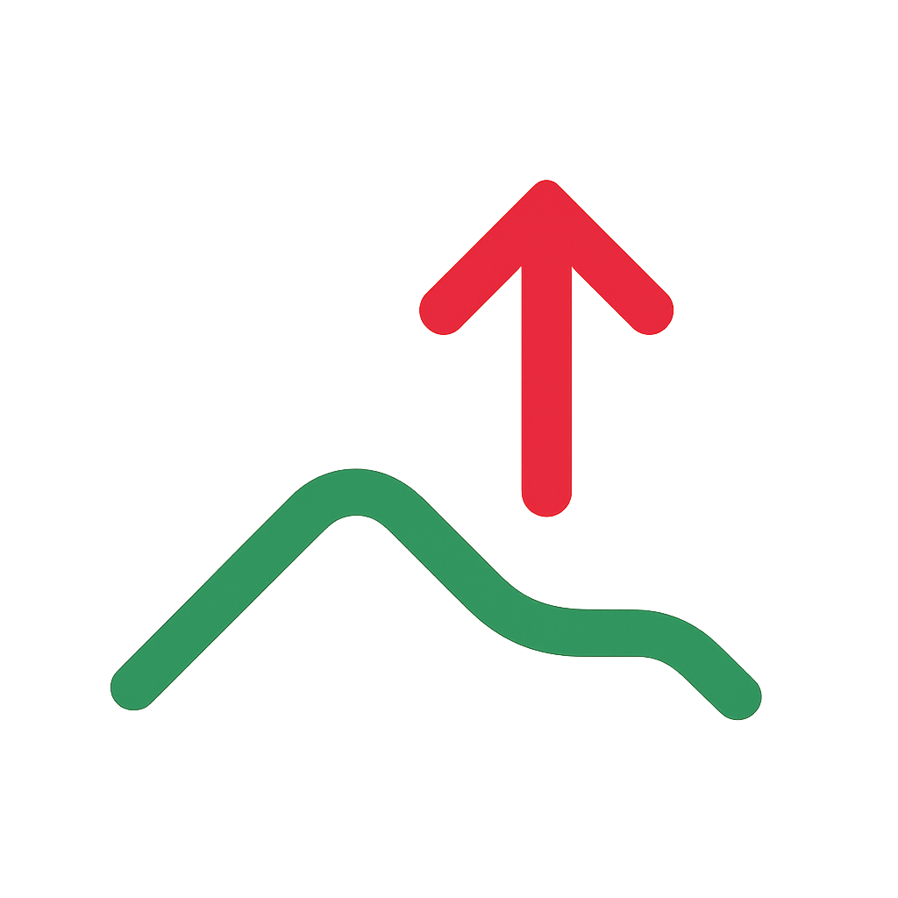
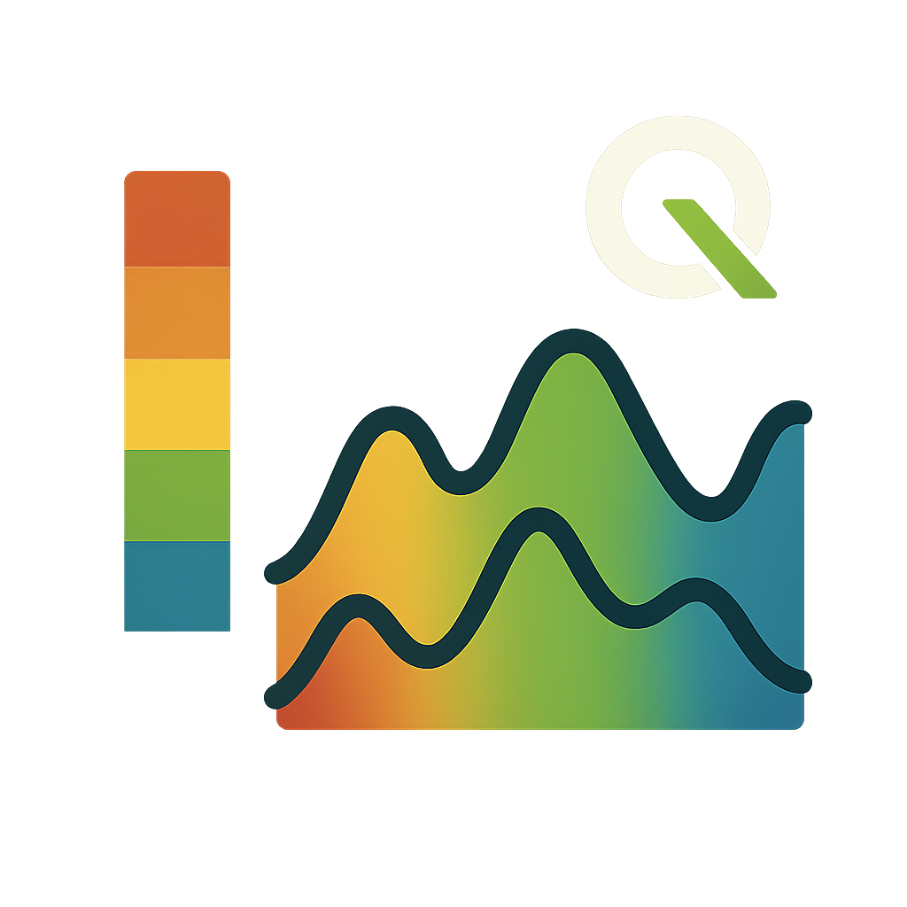
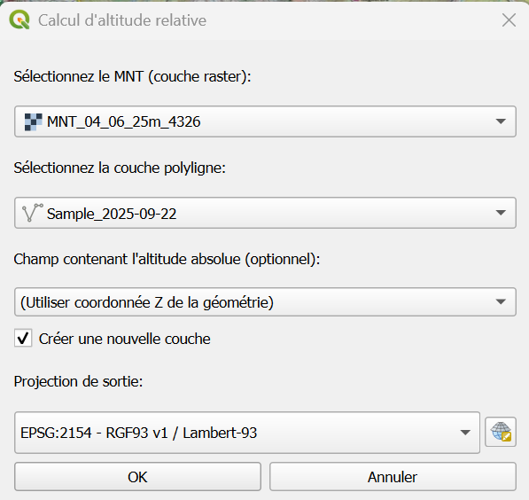
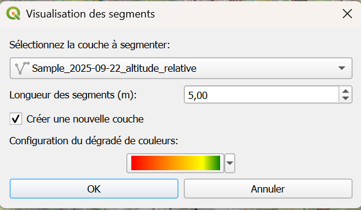
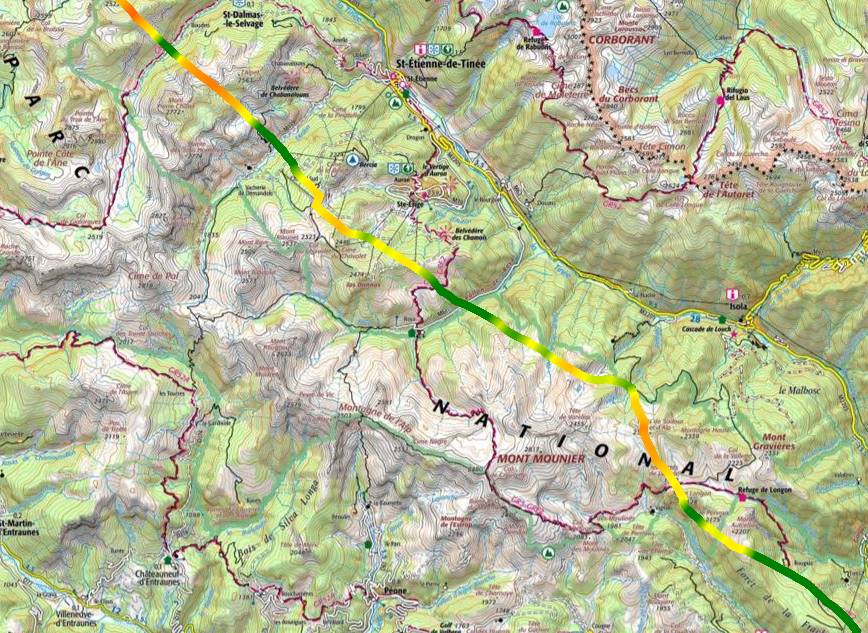
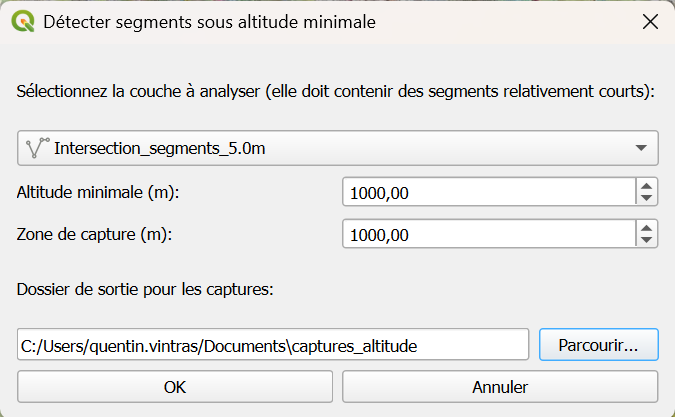

# Documentation Utilisateur - Plugin Analyse Survol

## Introduction

Le plugin **Analyse Survol** est un outil QGIS conçu pour analyser les trajectoires de vol et calculer les altitudes relatives par rapport au sol. Il est particulièrement utile pour :
- L'analyse de conformité des vols par rapport aux altitudes minimales réglementaires
- La visualisation des segments de vol avec codes couleur selon l'altitude
- La détection automatique des dépassements d'altitude minimale
- La génération de rapports visuels avec captures de carte

### Caractéristiques principales
- **Calcul d'altitude relative** : Calcule l'altitude de vol par rapport au terrain
- **Visualisation colorée** : Affichage des segments avec dégradé de couleur selon l'altitude
- **Détection automatique** : Identification des zones de dépassement d'altitude minimale
- **Génération de rapports** : Captures automatiques avec marqueurs et distances
- **Support multi-projections** : Transformation automatique entre systèmes de coordonnées

## Installation

### Prérequis
- QGIS 3.40 ou version ultérieure
- Python 3.12+
- Modules Python : numpy (généralement inclus avec QGIS)

### Installation depuis le depot de plugins QGIS du Parc national du Mercantour

- Si le dépôt QGIS du Parc national du Mercantour n'est pas configuré dans QGIS suivre [la procédure d'installation](https://pnmercantour.github.io/donnees/tutos/installation_plugin_via_depot/)
- Dans QGIS allez dans **Extensions** → **Installer/Gérer les extensions**, dans l'onglet **Toutes**, recherchez l'extension `Analyse Survol` puis cliquez sur **Installer**

### Vérification de l'installation
Après activation, vous devriez voir :
- Une nouvelle barre d'outils "Analyse Survol" avec 3 boutons d'actions
- Un menu "Analyse Survol" dans le menu Vecteur

> **Remarque :** Effectuez les mises à jour du plugin régulièrement.

## Prise en main

### Interface utilisateur
Le plugin ajoute trois outils principaux accessibles via :
- **Barre d'outils** : Trois boutons avec icônes
- **Menu Vecteur** : Sous-menu "Analyse Survol"

### Données requises
Pour utiliser le plugin, vous devez disposer de :
1. **Couche MNT (Modèle Numérique de Terrain)** : Raster représentant l'altitude du sol
2. **Couche de trajectoire** : Ligne 3D (LineStringZ) avec coordonnées Z représentant l'altitude de vol

### Format des données
- **Trajectoires** : Format LineStringZ ou MultiLineStringZ avec coordonnées Z
- **MNT** : Format raster (GeoTIFF, ASCII Grid, etc.)
- **Systèmes de coordonnées** : Tous systèmes supportés par QGIS (transformation automatique)

## Fonctionnalités

### 1. Calcul d'altitude relative
**Objectif** : Calculer l'altitude de vol par rapport au terrain pour chaque point de la trajectoire.

**Fonctionnement** :
- Échantillonne l'altitude du sol (MNT) le long de la trajectoire
- Calcule la différence entre l'altitude de vol et l'altitude du sol
- Génère une nouvelle couche avec les altitudes relatives

**Options disponibles** :
- Choix de la projection de sortie
- Utilisation des coordonnées Z ou d'un champ d'attribut
- Création d'une nouvelle couche ou modification de l'existante

### 2. Visualisation des segments colorés
**Objectif** : Créer une visualisation colorée des segments de vol selon leur altitude.

**Fonctionnement** :
- Découpe la trajectoire en segments de longueur fixe
- Calcule l'altitude moyenne de chaque segment
- Applique un code couleur basé sur un dégradé personnalisable

**Options disponibles** :
- Longueur des segments (0.1 à 100 mètres)
- Configuration du dégradé de couleurs
- Épaisseur des traits (1.25mm par défaut)

### 3. Détection des dépassements d'altitude minimale
**Objectif** : Identifier automatiquement les zones où l'altitude de vol est inférieure à un seuil.

**Fonctionnement** :
- Analyse tous les segments de la trajectoire
- Identifie les groupes de segments consécutifs sous l'altitude minimale
- Génère des captures de carte avec marqueurs de début/fin
- Calcule les distances de dépassement

**Options disponibles** :
- Altitude minimale configurable
- Taille du buffer pour les captures
- Génération automatique de rapports visuels

## Guide d'utilisation détaillé

### Calcul d'altitude relative

#### Étape 1 : Préparation des données
1. Chargez votre couche MNT dans QGIS
2. Chargez votre couche de trajectoire (LineStringZ)
3. Vérifiez que les deux couches ont des systèmes de coordonnées cohérents

#### Étape 2 : Lancement du calcul
1. Cliquez sur l'icône "Calculer altitude relative" 
2. Dans la boîte de dialogue :
   - **MNT** : Sélectionnez votre couche raster
   - **Trajectoire** : Sélectionnez votre couche de ligne 3D
   - **Champ altitude** : Laissez sur "Coordonnée Z" ou choisissez un champ
   - **Projection de sortie** : Choisissez le système de coordonnées désiré (Lambert 93 par défaut)
   - **Nouvelle couche** : Cochez pour créer une nouvelle couche

#### Étape 3 : Résultats
La couche résultante contient :
- **Géométrie modifiée** : Coordonnées Z mises à jour avec l'altitude relative

### Visualisation des segments colorés

#### Étape 1 : Configuration
1. Cliquez sur "Visualiser segments colorés" 
2. Configurez les paramètres :
   - **Couche source** : Sélectionnez votre trajectoire (celle calculée précédemment avec l'altitude relative)
   - **Longueur segments** : 5 mètres recommandé
   - **Dégradé de couleurs** : Personnalisez selon vos besoins
   - **Nouvelle couche** : Recommandé pour préserver l'original

#### Étape 2 : Personnalisation du dégradé
Le dégradé par défaut :
- **Rouge (0m)** : Altitude très faible
- **Orange (500m)** : Altitude faible
- **Jaune (800m)** : Altitude moyenne
- **Vert (1000m)** : Altitude élevée

Le dégradé prend en compte une altitude de 0m à 1000m, ainsi si on place une couleur à 50% cela correspondra à une altitude de 500m.
 
#### Étape 3 : Résultats
Une nouvelle couche avec :
- Segments colorés selon l'altitude
- Traits épaissis pour meilleure visibilité
- Attributs : altitude moyenne du segment, longueur du segment, code couleur

### Détection des dépassements

#### Étape 1 : Configuration de la détection
1. Cliquez sur "Détecter segments sous altitude min." 
2. Paramètres :
   - **Couche** : Trajectoire à analyser (Attention à bien analyser la trajectoire utilisée pour la visualisation)
   - **Altitude minimale** : Seuil en mètres (ex: 1000m)
   - **Buffer capture** : Zone autour du segment (1000m recommandé)
   - **Dossier de sortie** : Dossier de stockage des captures

#### Étape 2 : Analyse automatique
Le plugin :
- Identifie tous les segments sous le seuil
- Groupe les segments consécutifs (qui se touchent)
- Calcule la distance totale de chaque groupe
- Génère une capture pour chaque groupe

#### Étape 3 : Résultats et rapports
**Captures générées** :
- Nom : `groupe_X_altYYYm_ZZZm.png`
- Titre avec longueur du segment et altitude minimale sur le segment
- Marqueurs : Début et fin de zone
- Capture de la carte avec la vue actuellement paramétrée

**Rapport textuel** :
```
3 segments répartis en 2 groupe(s) sous l'altitude minimale de 150m.
Distance totale: 450m

- Groupe de 2 segments à 120m (300m)
- Groupe de 1 segments à 140m (150m)

Captures avec marqueurs sauvegardées dans /chemin/captures_altitude
```

## Cas d'usage

### Analyse de conformité de vol

Des données d'exemple sont disponibles via ce [lien](https://qgis-depot.mercantour.eu/data_example/analyse_survol_example_data.zip). Il faut télécharger les données, dézipper et ouvrir le projet QGIS contenu dans le dossier.

**Contexte** : Vérifier qu'un vol respecte l'altitude minimale de 1000m au-dessus du sol.

**Procédure** :

1. Calculer l'altitude relative avec le MNT local

    - Charger le MNT dans QGIS

    - Charger la trajectoire du vol dans QGIS

    - Cliquer sur l'icône "Calculer altitude relative" 

    - Sélectionner la couche MNT et la trajectoire dans la boite de dialogue
    

    - Cliquer sur OK

    - Une nouvelle couche doit apparaitre avec comme coordonnée z l'altitude relative par rapport au sol

    - Optionnel : Filtrer cette couche sur l'emprise totale du Parc National (peut accélérer les futurs calculs)

2. Visualiser l'altitude du survol
    - Cliquer sur l'icône "Calculer altitude relative" 
    - Sélectionner la couche avec les altitudes relatives
    
    - Optionnel : Modifier le dégradé pour une visualisation différente et adapter la longueur des sous-segments
    - Cliquer sur OK
    - Une nouvelle couche apparait avec la colormap définie
    

3. Extraire les zones de survol illicites
    - Sélectionner les couches à afficher dans les rapports (Carte IGN Topo, couche visualisation de l'altitude relative...)
    - Cliquer sur l'icône "Détecter segments sous altitude min." 
    - Sélectionner la couche à analyser qui est celle utilisée pour visualiser.
    
    - Définir l'altitude minimale considérée comme illicite, éventuellement une zone de capture autour du segment (uniquement pour modifier l'affichage) et modifier le dossier de sortie des rapports pour chaque segment.
    - Cliquer sur OK
    - Attendre la fin du traitement et récupérer les captures dans le dossier de sortie
    

*Plugin Analyse Survol - Version 1.0*  
*Documentation utilisateur mise à jour le 24 septembre 2025*